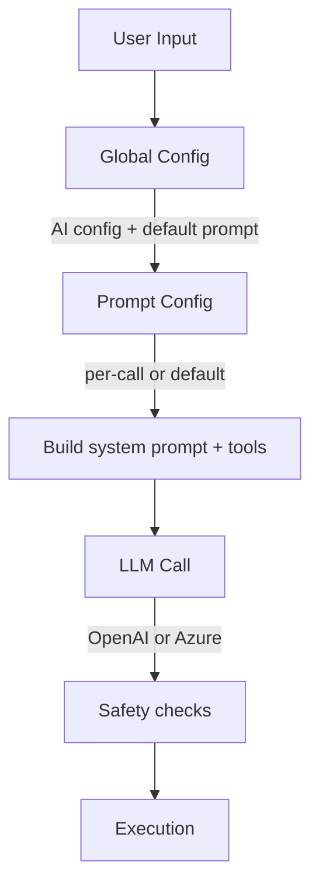

<!-- markdownlint-disable MD025 MD040 MD004 MD022 MD031 MD032 MD046 -->

# SAI Technical Specification
**Version 1.0**  
**MIT Licensed**

This document describes the design, architecture, and safety model of **SAI**, the natural-language–to–shell-command generator.

It complements the high-level README by describing how the system works internally and the rationale behind each design choice.

---

# 1. Overview

SAI is a Rust CLI tool that converts natural language into **real, executable shell commands**, using an LLM configured via:

- a **global configuration file** (AI settings + default prompt)
- an optional **per-call prompt configuration file**
- optional **sample data** supplied by `--peek`

SAI enforces strong safety guarantees: only explicitly allowed tools may be used, and the output command must pass operator-level sanitization before execution.

---

# 2. Execution Model




## 2.1 Module Layout

- `main`: minimalist entry point delegating to `app::run()`.
- `app`: orchestrates CLI parsing, configuration loading, LLM invocation, confirmation, and command execution. Provides `run_with_dependencies` so tests can inject fakes.
- `cli`: clap-derived `Cli` structure describing every command-line flag.
- `config`: strongly typed configuration models plus loading and environment override resolution. Exposes `EffectiveAiConfig` used by the generator layer.
- `prompt`: builds the system prompt and allowed tool whitelist from a `PromptConfig` instance.
- `peek`: constructs the optional peek context, applying the 16 KiB truncation rule per file.
- `llm`: defines the `CommandGenerator` trait and its default `HttpCommandGenerator` implementation backed by `reqwest`.
- `safety`: rejects disallowed tools or shell operators and returns the parsed token list.
- `executor`: houses the `CommandExecutor` trait and the default `ShellCommandExecutor` that toggles between direct spawning and shell delegation when `--unsafe` is set.
- `ops`: shared helpers for `--init`, `--create-prompt`, `--add-prompt`, and `--list-tools`, including the duplicate-resolution helper used during prompt merges.
- `scope`: utilities for building scope-aware context (currently the `"."` directory listing helper).

Each module is testable in isolation, with the traits (`CommandGenerator`, `CommandExecutor`) providing seam points for mocking inside unit tests.

---

# 3. Configuration Model

## 3.1 Global Configuration (`config.yaml`)

Located at:

- **Linux:** `~/.config/sai/config.yaml`
- **macOS:** `~/Library/Application Support/sai/config.yaml`
- **Windows:** `%APPDATA%/sai/config.yaml`

Contains two sections:

### `ai`  
Configures the provider:

```

ai:
provider: openai | azure
openai_api_key: …
openai_model: …
azure_api_key: …
azure_endpoint: …
azure_deployment: …
azure_api_version: …

```

Environment variables override these fields.

### `default_prompt`  
Defines:

### Initialization helper

Running `sai --init` writes a starter `config.yaml` at the OS location above.  
The generated file contains placeholder API credentials (e.g., `changeme`) and **no tools**.  
Operators add tools later (for example via `sai --add-prompt`) so the whitelist always reflects locally installed binaries. Existing configs are never overwritten.

## 3.2 Per-call Prompt Config

First positional argument in advanced mode.

Same format as `default_prompt`.

If present, it **replaces** the default prompt.

### Prompt authoring helpers

`sai --create-prompt <tool> [path]` emits a template prompt config for a single tool.  
If `path` is omitted, the file is saved as `<tool>.yaml` in the current working directory.

`sai --add-prompt <path>` merges the tools from the provided prompt file into the global `default_prompt`.  
If tool names collide, SAI enters an interactive resolution loop for **each** duplicate: show the current global definition and the imported definition, then let the operator **Overwrite**, **Skip**, or **Cancel** the entire import.  
When stdin is not a TTY, duplicates raise a clear error instead of defaulting silently. No config writes occur until all conflicts are resolved successfully; a cancel leaves the global config untouched.

### Tool inventory helper

`sai --list-tools [prompt.yaml]` prints the tool names sourced from the global default prompt and, when a prompt path is supplied, from that file as well. Each tool entry also indicates whether it is currently discoverable on the operator's `PATH` (`[x]` present, `[ ]` missing).  
The command is informational only; no LLM call occurs and no shell command is executed.

---

# 4. LLM Prompt Construction

The `llm` module exposes a `CommandGenerator` trait so different backends (HTTP, mock, future streaming) can plug in. The default `HttpCommandGenerator` builds the following message sequence before issuing a blocking `reqwest` request:

SAI constructs the final LLM context as:

1. **System message**  
   Built from:
   - `meta_prompt`
   - list of allowed tool names
   - detailed tool instructions

2. **User message**  
   The natural language request.

3. **User (scope hint) message** *(optional)*  
   Included when the operator supplies `-s/--scope`; provides glob/path hints such as `logs/**/*.json` or free-form descriptions ("only PDF documents").
   - Special case: when scope is exactly `"."`, the scope message embeds a non-recursive listing of the current working directory. The helper `scope::build_scope_dot_listing` gathers names (directories get a trailing `/`), applies the `SCOPE_DOT_MAX_BYTES` cap, and appends `(truncated directory listing)` when shortened.

4. **User (data sample) message** *(optional)*  
   Only added when using `--peek`.

Example:

```

Here is a sample of the data the tools will operate on.
It may be truncated and is provided only to infer structure and field names:
<sample 1>
<sample 2>

```

---

# 5. Peek Mode (`--peek`)

## 5.1 Purpose

Giving the LLM **representative sample data** improves:

- field name inference,
- JSON path discovery,
- handling of nested structures,
- more precise jq filters.

## 5.2 Truncation

Each peek file is read up to **16 KB**.  
If larger, SAI annotates:

```

(truncated after 16384 bytes)

```

This keeps LLM context bounded and prevents accidental large uploads.

## 5.3 Safety

Peek is **fully opt-in**.  
No data is ever sent unless user provides `--peek`.

---

# 6. Safety Model

Safety consists of **three independent layers**.

---

## 6.1 Tool Whitelisting

Only tools listed in the prompt config may be used.

SAI enforces:

- First token of the generated command must match an allowed tool name.

Example failure:

```

Disallowed command 'rm'. Allowed tools: jq

```

---

## 6.2 Operator-Level Blocking

Unless `--unsafe` is used, SAI rejects commands containing:

- pipes: `|`
- redirects: `>`, `>>`, `<`
- command substitution: `$(`, `` `cmd` ``
- chaining: `;`, `&&`, `||`
- backgrounding: `&`
- process substitution, or derived constructs

This prevents:

```

cat file | rm -rf /

```

Example failure:

```

Disallowed shell operator '|' in generated command.
Re-run with --unsafe if you really want to execute it.

````

---

## 6.3 Confirmation Layer

SAI provides two confirmation modes:

- Explicit `--confirm`
- Implicit when using `--unsafe`

Confirmation shows:

- Global config path
- Prompt config path
- Natural language prompt
- Full generated command
- Y/N choice

The user must explicitly approve before execution.

---

# 7. Unsafe Mode (`--unsafe`)

Disables operator blocking, but **forces interactive confirmation**.

Used only when the LLM must generate commands involving:

- pipes,
- redirections,
- multi-step operations.

Example:

```bash
sai -u "Count unique identifiers then sort by frequency"
````

---

# 8. Execution Model

The `executor` module defines a `CommandExecutor` trait so alternative execution strategies (dry runs, logging, sandboxing) can be substituted. The default `ShellCommandExecutor` behaves as follows:

- **Safe mode:** spawns the tool directly with `Command::new(tokens[0]).args(&tokens[1..])`, preventing shell interpolation.
- **Unsafe mode:** delegates to the platform shell (`sh -c` on Unix, `cmd /C` on Windows) so that pipes and redirects function while still funnelling through the confirmation gate.

This split keeps the “no shell by default” invariant while still enabling power users to opt into shell semantics explicitly.

---

# 9. Testing Strategy

- Module-level unit tests cover prompt building, peek truncation, configuration merging, operator detection, and executor behaviour. Each test invokes the respective module in isolation without hitting the network.
- The `app::run_with_dependencies` helper allows integration-style tests to inject mock implementations of `CommandGenerator` or `CommandExecutor` when richer scenarios are needed.
- `tempfile`-backed fixtures keep filesystem manipulations isolated to throwaway directories.
- Execute `cargo test` to run the suite; no external services are contacted.

# 10. Error Handling

Typical error conditions:

* Missing AI configuration
* Invalid prompt config
* Disallowed tool name
* Forbidden operator
* LLM returned empty or unparsable output
* Missing or unreadable peek file

All errors include clear diagnostic messages.

---

# 11. Build and Release

SAI provides a GitHub Actions workflow building:

* Linux
* macOS
* Windows

All builds use Rust stable and upload artifacts for release.

---

# 12. License

MIT License.
