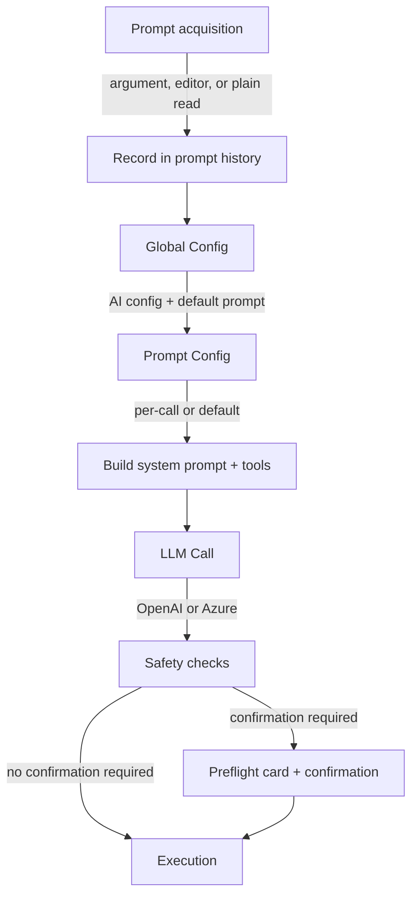

<!-- markdownlint-disable MD025 MD040 MD004 MD022 MD031 MD032 MD046 -->

# SAI Technical Specification
**Version 1.2**  
**MIT Licensed**

This document describes the design, architecture, and safety model of **SAI**, the natural-language–to–shell-command generator.

It complements the high-level README by describing how the system works internally and the rationale behind each design choice.

---

# 1. Overview

SAI is a Rust CLI tool that converts natural language into **real, executable shell commands**, using an LLM configured via:

- a **global configuration file** (AI settings + default prompt)
- an optional **per-call prompt configuration file**
- optional **sample data** supplied by `--peek`

The prompt itself comes from a command-line argument, an interactive mini editor, or a plain line read from standard input; the choice does not affect anything downstream.

SAI enforces strong safety guarantees: only explicitly allowed tools may be used, and the output command must pass operator-level sanitization before execution. Both restrictions can be relaxed per call, but only in exchange for mandatory inspection that no flag or configuration value can suppress.

---

# 2. Execution Model


```mermaid
flowchart TD
    A[Prompt acquisition] --> |argument, editor, or plain read| A2[Record in prompt history]
    A2 --> B[Global Config]
    B --> |AI config + default prompt| C[Prompt Config]
    C --> |per-call or default| D[Build system prompt + tools]
    D --> E[LLM Call]
    E --> |OpenAI or Azure| F[Safety checks]
    F --> |confirmation required| G[Preflight card + confirmation]
    F --> |no confirmation required| H[Execution]
    G --> H
```

The prompt is acquired before any model call and recorded in the prompt history
at submission time, so a prompt that produces an LLM error remains recallable.
The preflight card and confirmation appear only on runs that require one; a run
that executes directly is unchanged by their existence.


## 2.1 Module Layout

- `main`: minimalist entry point delegating to `app::run()`.
- `app`: orchestrates CLI parsing, configuration loading, LLM invocation, confirmation, and command execution. Provides `run_with_dependencies` so tests can inject fakes.
- `cli`: clap-derived `Cli` structure describing every command-line flag.
- `config`: strongly typed configuration models plus loading and environment override resolution. Exposes `EffectiveAiConfig` used by the generator layer.
- `prompt`: builds the system prompt and allowed tool whitelist from a `PromptConfig` instance.
- `peek`: constructs the optional peek context, applying the 16 KiB truncation rule per file.
- `llm`: defines the `CommandGenerator` trait and its default `HttpCommandGenerator` implementation backed by `reqwest`.
- `safety`: rejects disallowed tools or shell operators and returns the parsed token list. Also computes the deterministic `RiskMarker` set shown on the preflight card.
- `safety_mode`: the `SafetyMode` ladder (`Default`, `Unsafe`, `Unrestricted`) resolved once from the CLI flags, and the single place that answers whether operators are allowed, whether the whitelist applies, whether inspection is forced, and whether execution goes through a shell.
- `editor`: the interactive mini editor. `EditorState` is a pure state machine driven by injected `crossterm` key events and never touches the terminal, so every editing, navigation and search behaviour is unit-testable headlessly; the terminal driver at the bottom of the module renders what the state reports.
- `prompt_history`: NDJSON storage of submitted prompts under the config directory, with rotation, corrupt-line skipping, consecutive-duplicate collapsing, and newest-first loading for editor recall.
- `executor`: houses the `CommandExecutor` trait and the default `ShellCommandExecutor` that toggles between direct spawning and shell delegation according to `SafetyMode::uses_shell()`.
- `history`: implements NDJSON-based invocation logging with automatic rotation, plus latest-entry retrieval for the `--analyze` mode.
- `ops`: shared helpers for `--init`, `--create-prompt`, `--add-prompt`, and `--list-tools`, including the duplicate-resolution helper used during prompt merges.
- `scope`: utilities for building scope-aware context (currently the `"."` directory listing helper).
- `help`: hierarchical help system with 16 topics plus the `topics` index, covering all major features. Provides `try_handle_help()` for early interception of `sai help` commands and `render_help()` for topic-specific content.

Each module is testable in isolation, with the traits (`CommandGenerator`, `CommandExecutor`) providing seam points for mocking inside unit tests.

---

# 3. Configuration Model

## 3.1 Global Configuration (`config.yaml`)

Located at:

- **Linux:** `~/.config/sai/config.yaml`
- **macOS:** `~/Library/Application Support/sai/config.yaml`
- **Windows:** `%APPDATA%/sai/config.yaml`

Contains two sections:

### `ai`  
Configures the provider:

```

ai:
provider: openai | azure
openai_api_key: …
openai_api_mode: responses | chat_completions
openai_model: …
openai_model_snapshot: … # optional
openai_reasoning_effort: … # optional
azure_api_key: …
azure_endpoint: …
azure_deployment: …
azure_api_version: …

```

Environment variables override these fields. For OpenAI, SAI defaults to the
Responses API when `openai_api_mode` is omitted.

### `default_prompt`  
Defines:

### Initialization helper

Running `sai --init` writes a starter `config.yaml` at the OS location above.  
The generated file contains placeholder API credentials (e.g., `changeme`) and a curated default tool whitelist sourced from `templates/default-config.yaml` (for example: `rg`, `grep`, `find`, `awk`, `sed`, `wc`).  
Operators can extend or adjust these defaults with `sai --add-prompt` or direct YAML edits. Existing configs are never overwritten.

## 3.2 Per-call Prompt Config

First positional argument in advanced mode.

Same format as `default_prompt`.

If present, it **replaces** the default prompt.

## 3.3 Tool-Level Force Explain

Each `ToolConfig` supports an optional `force_explain` field:

```rust
pub struct ToolConfig {
    pub name: String,
    pub config: String,
    pub force_explain: Option<bool>,
}
```

**Behavior:**

When `force_explain` is `true`, any generated command using that tool will:
1. Automatically enable explain mode (LLM explains the command)
2. Implicitly enable confirm mode
3. Report the tool config as the explanation's source on the preflight card, as `Explain: tool config (<tool>: force_explain)`

The explanation source is tracked as a structured `ExplainSource` value rather
than a bare boolean, so the card can distinguish an explanation demanded by
`--explain`, one forced by a tool's `force_explain`, and one mandated by
`--unrestricted`. Under `--unrestricted` the mode takes precedence, because it
is the reason that cannot be removed.

This provides defense-in-depth for dangerous operations while maintaining explicit user control via `--explain` for all other tools.

**Serialization:**
- `None` → field omitted from YAML
- `Some(true)` → `force_explain: true` in YAML
- `Some(false)` → `force_explain: false` in YAML (explicit override)

**Merge behavior during `--add-prompt`:**

When merging tools with duplicate names:
- If incoming tool has `force_explain: None` and existing has `Some(true)`, the existing value is **preserved**
- If incoming tool has `force_explain: Some(false)` or `Some(true)`, it **overrides** the existing value
- User is notified when preservation occurs: "(preserving force_explain from global config)"

This ensures safety flags aren't accidentally lost during config merges while still allowing explicit removal when desired.

### Prompt authoring helpers

`sai --create-prompt <tool> [path]` emits a template prompt config for a single tool.  
If `path` is omitted, the file is saved as `<tool>.yaml` in the current working directory.

`sai --add-prompt <path>` merges the tools from the provided prompt file into the global `default_prompt`.  
If tool names collide, SAI enters an interactive resolution loop for **each** duplicate: show the current global definition and the imported definition, then let the operator **Overwrite**, **Skip**, or **Cancel** the entire import.  
When stdin is not a TTY, duplicates raise a clear error instead of defaulting silently. No config writes occur until all conflicts are resolved successfully; a cancel leaves the global config untouched.

### Tool inventory helper

`sai --list-tools [prompt.yaml]` prints the tool names sourced from the global default prompt and, when a prompt path is supplied, from that file as well. Each tool entry also indicates whether it is currently discoverable on the operator's `PATH` (`[x]` present, `[ ]` missing).  
The command is informational only; no LLM call occurs and no shell command is executed.

---

# 4. LLM Prompt Construction

The `llm` module exposes a `CommandGenerator` trait so different backends (HTTP, mock, future streaming) can plug in. The default `HttpCommandGenerator` builds the following message sequence before issuing a blocking `reqwest` request:

SAI constructs the final LLM context as:

1. **System message**  
   Built from:
   - `meta_prompt`
   - list of allowed tool names
   - detailed tool instructions

2. **User message**  
   The natural language request.

3. **User (scope hint) message** *(optional)*  
   Included when the operator supplies `-s/--scope`; provides glob/path hints such as `logs/**/*.json` or free-form descriptions ("only PDF documents").
   - Special case: when scope is exactly `"."`, the scope message embeds a non-recursive listing of the current working directory. The helper `scope::build_scope_dot_listing` gathers names (directories get a trailing `/`), applies the `SCOPE_DOT_MAX_BYTES` cap, and appends `(truncated directory listing)` when shortened.

4. **User (data sample) message** *(optional)*  
   Only added when using `--peek`.

Example:

```

Here is a sample of the data the tools will operate on.
It may be truncated and is provided only to infer structure and field names:
<sample 1>
<sample 2>

```

---

# 5. Peek Mode (`--peek`)

## 5.1 Purpose

Giving the LLM **representative sample data** improves:

- field name inference,
- JSON path discovery,
- handling of nested structures,
- more precise jq filters.

## 5.2 Truncation

Each peek file is read up to **16 KB**.  
If larger, SAI annotates:

```

(truncated after 16384 bytes)

```

This keeps LLM context bounded and prevents accidental large uploads.

## 5.3 Safety

Peek is **fully opt-in**.  
No data is ever sent unless user provides `--peek`.

---

# 6. Prompt Input and Composition

## 6.1 Prompt Sources

The prompt reaching command generation is identical whatever produced it. `cli::resolve_prompt_source` decides where it comes from, as a pure function of the parsed flags and whether stdin is a TTY — it never touches the terminal, so the decision is unit-testable:

1. `--no-interactive` never opens the editor.
2. `--interactive` always opens it, using any prompt argument as the starting buffer.
3. A prompt argument is used verbatim.
4. Outside a terminal, one line is read from standard input.
5. Otherwise the editor opens.

A prompt supplied as an argument therefore runs exactly as it did before the editor existed, which keeps every script and pipeline byte-for-byte compatible. Under `--interactive` a lone positional is always prompt text, never a config path; `--prompt-config` exists to supply a per-call config alongside it.

When the terminal refuses raw mode, SAI reports the limitation and falls back to the single-line read rather than aborting the run.

## 6.2 Editor Architecture

`EditorState` holds the buffer as a flat `String` with a **character-indexed** cursor, converted to byte offsets only at splice points. Line structure is *derived* from the buffer rather than stored beside it, which makes the buffer the single source of truth: the submitted payload is what the user typed, with no reassembly step that could diverge from it.

The state machine returns an `EditorAction` (continue, redraw, or finish with an outcome) and never writes to the terminal. The driver loop feeds it `crossterm` key events and renders what it reports, so tests drive the editor by supplying a scripted event sequence. An RAII guard disables raw mode and restores cursor visibility on `Drop`, so panics and early returns both leave the terminal clean.

Rendering draws a variable-height prompt area — one row per buffer line, then the optional key panel, then the hint and indicator rows. It is entered and left with the cursor on the top row of the area, so clearing from the cursor down erases the area whatever its height; every render therefore has a net vertical displacement of zero. Cursor columns are computed in display width, not character count, so wide glyphs stay aligned. A prompt area taller than the window is capped so it cannot scroll off its anchor.

## 6.3 Key Bindings

| Key | Action |
| --- | --- |
| Left / Right | Move across characters, traversing line breaks |
| Up / Down | Move between buffer lines; navigate history at the first/last line |
| Home / End, `Ctrl+A` / `Ctrl+E` | Start / end of the **current line** |
| `Ctrl+K` / `Ctrl+U` | Kill to end / start of the current line, leaving other lines intact |
| `Ctrl+L` | Clear and redraw the prompt area |
| `Ctrl+R` | Reverse incremental search over prompt history |
| `Ctrl+G` | Toggle the expanded key panel |
| `Alt+Enter` or `Ctrl+J` | Insert a line break |
| Enter | Submit the whole buffer |
| Esc / `Ctrl+C` | Cancel, recording nothing and exiting cleanly |

`Ctrl+J` exists because some terminals do not distinguish `Alt+Enter`. The control shortcuts act on the current line rather than the whole buffer, matching readline; a single `Ctrl+U` cannot wipe several composed lines.

Up and Down dispatch on the cursor's line, read off the buffer each keystroke, with no mode flag. In a single-line buffer both edge conditions hold immediately, so the keys reach history exactly as they did before multi-line composition — the compatibility guarantee is structural rather than special-cased.

## 6.4 Composition Boundary

The editor composes natural-language text only. Shell metacharacters are literal, line breaks carry no shell meaning, and the editor does not reopen after a submitted prompt has been processed — one prompt per invocation. This is what keeps SAI a command generator rather than a shell replacement.

A buffer that is empty or whitespace-only is not submitted; the editor stays open. Cancellation records no prompt-history entry and exits with a success status distinguishable from an error.

---

# 7. Safety Model

Safety consists of **four independent layers**: tool whitelisting, operator-level blocking, the preflight card with its locally computed risk markers, and the confirmation gate. Which of the first two apply is decided by the `SafetyMode` resolved once from the CLI flags:

| Mode | Flag | Tool whitelist | Operators | Inspection |
| --- | --- | --- | --- | --- |
| Default | *(none)* | enforced | blocked | per flags and `force_explain` |
| Unsafe | `--unsafe` / `-u` | enforced | allowed | confirmation forced |
| Unrestricted | `--unrestricted` | lifted | allowed | explanation **and** confirmation forced |

The ladder is deliberately monotonic: each rung relaxes a restriction and pays for it with mandatory inspection. `--unrestricted` without `--unsafe` is unrepresentable — lifting the whitelist implies lifting operator blocking too.

---

## 7.1 Tool Whitelisting

Only tools listed in the prompt config may be used.

SAI enforces:

- First token of the generated command must match an allowed tool name.

Example failure:

```

Disallowed command 'rm'. Allowed tools: jq

```

---

## 7.2 Operator-Level Blocking

Unless `--unsafe` is used, SAI rejects commands containing:

- pipes: `|`
- redirects: `>`, `>>`, `<`
- command substitution: `$(`, `` `cmd` ``
- chaining: `;`, `&&`, `||`
- backgrounding: `&`
- process substitution, or derived constructs

This prevents:

```

cat file | rm -rf /

```

Example failure:

```

Disallowed shell operator '|' in generated command.
Re-run with --unsafe if you really want to execute it.

````

---

## 7.3 Unrestricted Mode (`--unrestricted`)

`--unsafe` relaxes operators but keeps the tool whitelist. `--unrestricted` lifts the whitelist as well, in **generation** as well as validation — the system prompt tells the model it may choose freely, rather than constraining generation and then rejecting the result.

In exchange, inspection becomes mandatory and nothing can suppress it: the command is always explained, always confirmed, and the confirmation requires typing `yes` in full. A bare `y` clears every other prompt in SAI and deliberately does not clear this one, because this is the mode where a wrong command is unbounded. There is no `--no-explain`, `--no-confirm`, `--quiet` or `--yes` flag anywhere in the CLI, and a test asserts none exists so configuration cannot erode the guarantee.

The mode can be forbidden outright:

```yaml
safety:
  allow_unrestricted: false
```

SAI refuses before contacting the model, so a forbidden run costs no tokens and records no command. Unrestricted runs carry a dedicated `unrestricted` field in the history log, so later auditing can tell them apart.

## 7.4 Preflight Card and Risk Markers

Every confirmation is preceded by a compact preflight card written to stderr. A run that executes without confirming produces no card and is byte-identical to what it produced before the card existed.

```text
Preflight:
  Prompt:  remove generated files and record their names
  Command: rm -rf target | tee removed.log
  Tool:    rm
  Safety:  unrestricted
  Explain: unrestricted mode (mandatory inspection)
  Risk:    [shell operators] contains |
           [destructive] rm — recursive and forced deletion
  Config:  global default (~/.config/sai/config.yaml)
```

Fields: the submitted prompt, the full command (never truncated), the primary tool, the scope hint when one was given, the effective safety mode, the explanation source when there was one, the risk markers, and the prompt-config provenance. Scope and Explain rows appear only when they apply, keeping the typical card to six lines.

The primary tool is taken from `tokens[0]` as returned by `validate_and_split_command` — the exact string the whitelist checked — rather than re-splitting the command line, so the card can never name a tool other than the one that was actually validated.

**Why the markers exist.** The explanation is written by the same model that produced the command, so it is not an independent check: a destructive command can receive a calm, plausible explanation. `safety::risk_markers` therefore derives markers from the command text alone — no model, no filesystem, no execution — covering shell operators, recursive or forced deletion, and wildcards reaching outside the working directory. Marker computation is deterministic and side-effect free.

Wildcard breadth is deliberately tuned to over-mark: an unnecessary marker is an annoyance, a missing one is a hazard. When a command carries no markers the card prints `Risk: none found` rather than leaving the field blank, so a clean command is distinguishable from one where markers were never computed.

Markers are **advisory**. They inform the confirmation and neither block nor approve anything.

## 7.5 Confirmation Layer

Confirmation is requested when any of these hold: `--confirm`, `--unsafe`, `--explain`, a tool's `force_explain`, or `--unrestricted`. The card is printed after any explanation and immediately before the prompt, so it is the last thing read before the decision.

Two confirmation functions exist and stay separate, preserving their different affirmative rules: the ordinary one accepts `y` or `yes`, the unrestricted one requires `yes` in full and is preceded by an explicit statement that no tool whitelist is in effect. That statement is deliberately kept outside the card so a later change to card formatting cannot quietly remove it.

Presenting the card changes nothing about execution: not which command runs, not whether it runs, not what is validated, not the history entry, and not the exit code.

---

# 8. Unsafe Mode (`--unsafe`)

Disables operator blocking, but **forces interactive confirmation**.

Used only when the LLM must generate commands involving:

- pipes,
- redirections,
- multi-step operations.

Example:

```bash
sai -u "Count unique identifiers then sort by frequency"
````

---

# 9. Execution Model

The `executor` module defines a `CommandExecutor` trait so alternative execution strategies (dry runs, logging, sandboxing) can be substituted. The default `ShellCommandExecutor` behaves as follows:

- **Safe mode:** spawns the tool directly with `Command::new(tokens[0]).args(&tokens[1..])`, preventing shell interpolation. Before execution, glob patterns (containing `*`, `?`, or `[`) in arguments are safely expanded using the `glob` crate. If a pattern matches files, those paths are passed to the command; if not, the literal string is used. This allows commands like `wc -l src/*` to work naturally without requiring shell invocation.
- **Unsafe mode:** delegates to the platform shell (`sh -c` on Unix, `cmd /C` on Windows) so that pipes and redirects function while still funnelling through the confirmation gate.

This split keeps the "no shell by default" invariant while still enabling power users to opt into shell semantics explicitly.

---

# 10. History and Analysis System

## 10.1 History Log Format

SAI maintains an append-only history log using newline-delimited JSON (NDJSON). Each SAI invocation writes exactly one entry containing:

```rust
pub struct HistoryEntry {
    pub ts: String,              // ISO 8601 UTC timestamp
    pub cwd: String,             // current working directory
    pub argv: Vec<String>,       // full CLI argv as seen by SAI
    pub exit_code: i32,          // process exit code
    pub generated_command: Option<String>, // final shell command, if any
    pub unsafe_mode: bool,       // whether operator blocking was relaxed
    pub unrestricted: bool,      // whether the tool whitelist was lifted (serde default)
    pub confirm: bool,           // whether confirmation was requested
    pub explain: bool,           // whether --explain was used
    pub scope: Option<String>,   // raw scope value, if any
    pub peek_files: Vec<String>, // list of peek paths, if any
    pub notes: Option<String>,   // optional free-form note (e.g. error summary)
}
```

`unrestricted` carries `#[serde(default)]` so entries written before the field existed still parse, reading as not unrestricted. Both relaxed modes set `unsafe_mode`, so an audit filtering on it still catches unrestricted runs, while `unrestricted` distinguishes the stronger one.

## 10.2 Log Location and Rotation

The history log resides in the standard config directory:

- **Linux:** `~/.config/sai/history.log`
- **macOS:** `~/Library/Application Support/sai/history.log`
- **Windows:** `%APPDATA%\sai\history.log`

The log automatically rotates when it exceeds `HISTORY_MAX_BYTES` (1 MB):

- Current log is renamed to `history.log.1`
- New entries start a fresh `history.log`
- Only one backup generation is kept

## 10.3 Prompt History Store

Submitted prompts are stored separately from the invocation log, because they answer a different question: `history.log` records what happened, `prompt_history.log` records what was asked. Mixing them would mean either polluting the audit log with editor state or making recall parse entries it does not need.

- **Location:** `prompt_history.log` beside `config.yaml` and `history.log` in the config directory.
- **Format:** NDJSON, one `{ts, prompt}` object per line. Each entry is independently parseable, so a single corrupt line is skipped rather than rendering the store unusable. JSON string escaping carries embedded newlines losslessly, so a multi-line prompt round-trips as one entry with no format change.
- **Rotation:** capped at 256 KB with a single `.bak` generation, mirroring the `history.log` approach. The newest entries always survive.
- **Permissions:** created owner-readable only where the platform supports it, since prompts can carry host names, paths and other environment detail.
- **Recording point:** at submission, before generation, so a prompt that produces an LLM error stays recallable. Argument-supplied prompts are recorded on the same path as composed ones. A cancelled composition records nothing.
- **Duplicates:** a prompt identical to the most recent entry is not appended again; non-consecutive repeats are recorded normally.
- **Failure handling:** a write failure is downgraded to a stderr warning so generation and execution continue.

The editor loads the store newest-first at startup. Up/Down walk it sequentially, restoring the pre-navigation draft when moving forward past the newest entry; `Ctrl+R` runs reverse incremental search over the full text of each entry, so a query matching any line of a multi-line prompt finds it. Recalled prompts land in the buffer as fully editable text — what gets submitted and recorded is the edited version.

## 10.4 Explain Mode (`--explain`)

When `--explain` is provided:

1. **Command generation** proceeds normally through the standard pipeline
2. **Explanation request** is sent to the LLM with a specialized system prompt:
   - Role: "shell and tool usage explainer"
   - Task: explain what the generated command will do, describing each flag and the overall effect
   - Temperature: 0.0 for consistency
3. **Display** shows both the command and its explanation
4. **Confirmation** is forced (implies `--confirm`) before execution
5. **History entry** records `explain: true`

The explanation helps users understand complex commands before executing them, particularly useful when learning new tools or validating LLM output.

## 10.5 Analyze Mode (`--analyze`)

The `--analyze` flag provides post-hoc analysis of the most recent SAI invocation:

1. **Mutually exclusive** with all normal SAI parameters (enforced via clap conflicts)
2. **Reads latest entry** from the history log using `history::read_latest_entry()`
3. **Builds analysis prompt** with:
   - System role: "debugging assistant for the SAI CLI"
   - User content: serialized `HistoryEntry` as JSON
   - Task: explain what likely happened, why, and suggest next steps
4. **LLM call** generates the analysis (no command generation occurs)
5. **Never executes commands** — purely informational
6. **Error handling**:
   - No history available → friendly message, exit code 2
   - LLM failure → error message, non-zero exit

This mode is particularly valuable for:

- Understanding unexpected failures
- Learning from successful commands
- Getting context-aware suggestions after errors

Both `--explain` and `--analyze` leverage the same LLM backend but serve different purposes in the workflow: explain prevents problems by clarifying intent before execution, while analyze diagnoses problems after they occur.

---

# 11. Help System

The `help` module provides a comprehensive, hierarchical help system accessible via `sai help` and `sai help <topic>`. This system is designed to make SAI fully self-documenting from the command line.

## 11.1 Architecture

- **Early interception**: `main.rs` calls `help::try_handle_help()` before normal CLI parsing to intercept `sai help` commands
- **Topic enumeration**: `HelpTopic` enum defines 16 topics plus the `topics` index, covering all major features
- **Static content**: Help text is compiled into the binary as `&'static str` constants
- **Hierarchical navigation**: Users start with `sai help` for overview, then drill into specific topics

## 11.2 Available Topics

The help system covers:

- **overview** - High-level introduction and philosophy
- **quickstart** - Minimal setup steps and first commands
- **config** - Global config location, AI providers, environment overrides
- **tools** - Tool definitions, prompt configs, whitelisting
- **scope** - Using `-s/--scope` to focus the LLM on relevant files
- **peek** - Sample data ingestion with `--peek` for schema inference
- **safety** - Safety model, operator blocking, confirmation prompts
- **unsafe** - What `--unsafe` relaxes and when to use it
- **unrestricted** - Lifting the tool whitelist with forced inspection
- **explain** - Command explanation before execution
- **analyze** - Post-mortem analysis of failed invocations
- **interactive** - Mini editor, key bindings, prompt history
- **history** - NDJSON log format, location, rotation
- **packages** - Built-in prompt configs in `prompts/` directory
- **ops** - Helper commands (`--init`, `--add-prompt`, `--list-tools`, etc.)
- **advanced** - Simple vs advanced mode, flag combinations
- **topics** - List all available topics

## 11.3 Usage Patterns

```bash
# Show top-level overview and common usage
sai help

# List all available topics
sai help topics

# Get detailed help on specific topic
sai help config
sai help scope
sai help explain
```

## 11.4 Design Principles

- **Self-contained**: No external documentation required for basic usage
- **Progressively discoverable**: Start broad, drill down as needed
- **Consistent terminology**: Aligns with README and code
- **Non-magical**: Plain text, no AI involved in help rendering
- **Compile-time validated**: Help text is checked at build time

The help system complements the README by providing quick command-line reference for users who want answers without leaving the terminal.

---

# 12. Testing Strategy

- Module-level unit tests cover prompt building, peek truncation, configuration merging, operator detection, risk-marker computation, executor behaviour, history logging, and rotation. Each test invokes the respective module in isolation without hitting the network.
- The editor is tested by feeding `KeyEvent` sequences directly to `EditorState`, so editing, multi-line composition, history navigation and reverse search are all verified without a terminal. `resolve_prompt_source` is a pure function of the flags and a `is_tty` boolean, so every mode-selection case is a plain unit test.
- The preflight card's `render` returns a `String`, so its contents are asserted directly rather than by capturing stderr.
- Prompt-history tests use the config-directory override helper to exercise persistence, rotation, corrupt-line skipping and duplicate collapsing against a temporary directory.
- The `app::run_with_dependencies` helper allows integration-style tests to inject mock implementations of `CommandGenerator` or `CommandExecutor` when richer scenarios are needed.
- `tempfile`-backed fixtures keep filesystem manipulations isolated to throwaway directories.
- History module tests verify:
  - Round-trip serialization of `HistoryEntry`
  - Rotation triggers when size threshold exceeded
  - Latest entry retrieval handles empty/malformed logs gracefully
  - Unrestricted runs are distinguishable in the log
- Terminal rendering — cursor alignment down a multi-row prompt area, redraw as the buffer grows and shrinks, behaviour in a short window — cannot be exercised headlessly and is verified manually. macOS has been checked; **Linux and Windows verification remains outstanding.**
- Execute `cargo test` to run the suite; no external services are contacted.

# 13. Error Handling

Typical error conditions:

* Missing AI configuration
* Invalid prompt config
* Disallowed tool name
* Forbidden operator
* Unrestricted mode forbidden by `safety.allow_unrestricted: false` — refused before any model call
* Conflicting `--interactive` and `--no-interactive` flags — rejected by clap
* No prompt available in a non-interactive context — exits non-zero with an explicit message
* Terminal refuses raw mode — reported, then degraded to a single-line read rather than failing
* LLM returned empty or unparsable output
* Missing or unreadable peek file
* No history available for `--analyze`
* History log read/write failures
* Prompt-history write failures — downgraded to a warning so the run continues

All errors include clear diagnostic messages.

---

# 14. Build and Release

SAI provides a GitHub Actions workflow building:

* Linux
* macOS
* Windows

All builds use Rust stable and upload artifacts for release.

---

# 15. License

MIT License.
