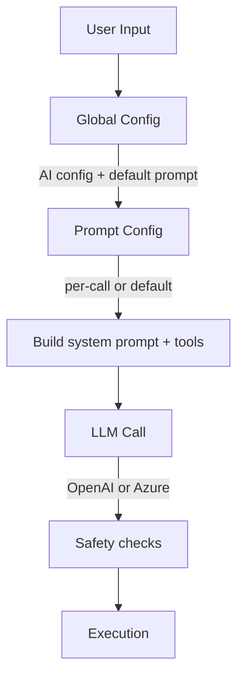

<!-- markdownlint-disable MD025 MD040 MD004 MD022 MD031 MD032 MD046 -->

# SAI Technical Specification
**Version 1.0**  
**MIT Licensed**

This document describes the design, architecture, and safety model of **SAI**, the natural-language–to–shell-command generator.

It complements the high-level README by describing how the system works internally and the rationale behind each design choice.

---

# 1. Overview

SAI is a Rust CLI tool that converts natural language into **real, executable shell commands**, using an LLM configured via:

- a **global configuration file** (AI settings + default prompt)
- an optional **per-call prompt configuration file**
- optional **sample data** supplied by `--peek`

SAI enforces strong safety guarantees: only explicitly allowed tools may be used, and the output command must pass operator-level sanitization before execution.

---

# 2. Execution Model




## 2.1 Module Layout

- `main`: minimalist entry point delegating to `app::run()`.
- `app`: orchestrates CLI parsing, configuration loading, LLM invocation, confirmation, and command execution. Provides `run_with_dependencies` so tests can inject fakes.
- `cli`: clap-derived `Cli` structure describing every command-line flag.
- `config`: strongly typed configuration models plus loading and environment override resolution. Exposes `EffectiveAiConfig` used by the generator layer.
- `prompt`: builds the system prompt and allowed tool whitelist from a `PromptConfig` instance.
- `peek`: constructs the optional peek context, applying the 16 KiB truncation rule per file.
- `llm`: defines the `CommandGenerator` trait and its default `HttpCommandGenerator` implementation backed by `reqwest`.
- `safety`: rejects disallowed tools or shell operators and returns the parsed token list.
- `executor`: houses the `CommandExecutor` trait and the default `ShellCommandExecutor` that toggles between direct spawning and shell delegation when `--unsafe` is set.
- `history`: implements NDJSON-based invocation logging with automatic rotation, plus latest-entry retrieval for the `--analyze` mode.
- `ops`: shared helpers for `--init`, `--create-prompt`, `--add-prompt`, and `--list-tools`, including the duplicate-resolution helper used during prompt merges.
- `scope`: utilities for building scope-aware context (currently the `"."` directory listing helper).
- `help`: hierarchical help system with 15+ topics covering all major features. Provides `try_handle_help()` for early interception of `sai help` commands and `render_help()` for topic-specific content.

Each module is testable in isolation, with the traits (`CommandGenerator`, `CommandExecutor`) providing seam points for mocking inside unit tests.

---

# 3. Configuration Model

## 3.1 Global Configuration (`config.yaml`)

Located at:

- **Linux:** `~/.config/sai/config.yaml`
- **macOS:** `~/Library/Application Support/sai/config.yaml`
- **Windows:** `%APPDATA%/sai/config.yaml`

Contains two sections:

### `ai`  
Configures the provider:

```

ai:
provider: openai | azure
openai_api_key: …
openai_model: …
azure_api_key: …
azure_endpoint: …
azure_deployment: …
azure_api_version: …

```

Environment variables override these fields.

### `default_prompt`  
Defines:

### Initialization helper

Running `sai --init` writes a starter `config.yaml` at the OS location above.  
The generated file contains placeholder API credentials (e.g., `changeme`) and **no tools**.  
Operators add tools later (for example via `sai --add-prompt`) so the whitelist always reflects locally installed binaries. Existing configs are never overwritten.

## 3.2 Per-call Prompt Config

First positional argument in advanced mode.

Same format as `default_prompt`.

If present, it **replaces** the default prompt.

## 3.3 Tool-Level Force Explain

Each `ToolConfig` supports an optional `force_explain` field:

```rust
pub struct ToolConfig {
    pub name: String,
    pub config: String,
    pub force_explain: Option<bool>,
}
```

**Behavior:**

When `force_explain` is `true`, any generated command using that tool will:
1. Automatically enable explain mode (LLM explains the command)
2. Implicitly enable confirm mode
3. Show a note indicating the tool requires explanation

This provides defense-in-depth for dangerous operations while maintaining explicit user control via `--explain` for all other tools.

**Serialization:**
- `None` → field omitted from YAML
- `Some(true)` → `force_explain: true` in YAML
- `Some(false)` → `force_explain: false` in YAML (explicit override)

**Merge behavior during `--add-prompt`:**

When merging tools with duplicate names:
- If incoming tool has `force_explain: None` and existing has `Some(true)`, the existing value is **preserved**
- If incoming tool has `force_explain: Some(false)` or `Some(true)`, it **overrides** the existing value
- User is notified when preservation occurs: "(preserving force_explain from global config)"

This ensures safety flags aren't accidentally lost during config merges while still allowing explicit removal when desired.

### Prompt authoring helpers

`sai --create-prompt <tool> [path]` emits a template prompt config for a single tool.  
If `path` is omitted, the file is saved as `<tool>.yaml` in the current working directory.

`sai --add-prompt <path>` merges the tools from the provided prompt file into the global `default_prompt`.  
If tool names collide, SAI enters an interactive resolution loop for **each** duplicate: show the current global definition and the imported definition, then let the operator **Overwrite**, **Skip**, or **Cancel** the entire import.  
When stdin is not a TTY, duplicates raise a clear error instead of defaulting silently. No config writes occur until all conflicts are resolved successfully; a cancel leaves the global config untouched.

### Tool inventory helper

`sai --list-tools [prompt.yaml]` prints the tool names sourced from the global default prompt and, when a prompt path is supplied, from that file as well. Each tool entry also indicates whether it is currently discoverable on the operator's `PATH` (`[x]` present, `[ ]` missing).  
The command is informational only; no LLM call occurs and no shell command is executed.

---

# 4. LLM Prompt Construction

The `llm` module exposes a `CommandGenerator` trait so different backends (HTTP, mock, future streaming) can plug in. The default `HttpCommandGenerator` builds the following message sequence before issuing a blocking `reqwest` request:

SAI constructs the final LLM context as:

1. **System message**  
   Built from:
   - `meta_prompt`
   - list of allowed tool names
   - detailed tool instructions

2. **User message**  
   The natural language request.

3. **User (scope hint) message** *(optional)*  
   Included when the operator supplies `-s/--scope`; provides glob/path hints such as `logs/**/*.json` or free-form descriptions ("only PDF documents").
   - Special case: when scope is exactly `"."`, the scope message embeds a non-recursive listing of the current working directory. The helper `scope::build_scope_dot_listing` gathers names (directories get a trailing `/`), applies the `SCOPE_DOT_MAX_BYTES` cap, and appends `(truncated directory listing)` when shortened.

4. **User (data sample) message** *(optional)*  
   Only added when using `--peek`.

Example:

```

Here is a sample of the data the tools will operate on.
It may be truncated and is provided only to infer structure and field names:
<sample 1>
<sample 2>

```

---

# 5. Peek Mode (`--peek`)

## 5.1 Purpose

Giving the LLM **representative sample data** improves:

- field name inference,
- JSON path discovery,
- handling of nested structures,
- more precise jq filters.

## 5.2 Truncation

Each peek file is read up to **16 KB**.  
If larger, SAI annotates:

```

(truncated after 16384 bytes)

```

This keeps LLM context bounded and prevents accidental large uploads.

## 5.3 Safety

Peek is **fully opt-in**.  
No data is ever sent unless user provides `--peek`.

---

# 6. Safety Model

Safety consists of **three independent layers**.

---

## 6.1 Tool Whitelisting

Only tools listed in the prompt config may be used.

SAI enforces:

- First token of the generated command must match an allowed tool name.

Example failure:

```

Disallowed command 'rm'. Allowed tools: jq

```

---

## 6.2 Operator-Level Blocking

Unless `--unsafe` is used, SAI rejects commands containing:

- pipes: `|`
- redirects: `>`, `>>`, `<`
- command substitution: `$(`, `` `cmd` ``
- chaining: `;`, `&&`, `||`
- backgrounding: `&`
- process substitution, or derived constructs

This prevents:

```

cat file | rm -rf /

```

Example failure:

```

Disallowed shell operator '|' in generated command.
Re-run with --unsafe if you really want to execute it.

````

---

## 6.3 Confirmation Layer

SAI provides two confirmation modes:

- Explicit `--confirm`
- Implicit when using `--unsafe`

Confirmation shows:

- Global config path
- Prompt config path
- Natural language prompt
- Full generated command
- Y/N choice

The user must explicitly approve before execution.

---

# 7. Unsafe Mode (`--unsafe`)

Disables operator blocking, but **forces interactive confirmation**.

Used only when the LLM must generate commands involving:

- pipes,
- redirections,
- multi-step operations.

Example:

```bash
sai -u "Count unique identifiers then sort by frequency"
````

---

# 8. Execution Model

The `executor` module defines a `CommandExecutor` trait so alternative execution strategies (dry runs, logging, sandboxing) can be substituted. The default `ShellCommandExecutor` behaves as follows:

- **Safe mode:** spawns the tool directly with `Command::new(tokens[0]).args(&tokens[1..])`, preventing shell interpolation. Before execution, glob patterns (containing `*`, `?`, or `[`) in arguments are safely expanded using the `glob` crate. If a pattern matches files, those paths are passed to the command; if not, the literal string is used. This allows commands like `wc -l src/*` to work naturally without requiring shell invocation.
- **Unsafe mode:** delegates to the platform shell (`sh -c` on Unix, `cmd /C` on Windows) so that pipes and redirects function while still funnelling through the confirmation gate.

This split keeps the "no shell by default" invariant while still enabling power users to opt into shell semantics explicitly.

---

# 9. History and Analysis System

## 9.1 History Log Format

SAI maintains an append-only history log using newline-delimited JSON (NDJSON). Each SAI invocation writes exactly one entry containing:

```rust
pub struct HistoryEntry {
    pub ts: String,              // ISO 8601 UTC timestamp
    pub cwd: String,             // current working directory
    pub argv: Vec<String>,       // full CLI argv as seen by SAI
    pub exit_code: i32,          // process exit code
    pub generated_command: Option<String>, // final shell command, if any
    pub unsafe_mode: bool,       // whether --unsafe was used
    pub confirm: bool,           // whether confirmation was requested
    pub explain: bool,           // whether --explain was used
    pub scope: Option<String>,   // raw scope value, if any
    pub peek_files: Vec<String>, // list of peek paths, if any
    pub notes: Option<String>,   // optional free-form note (e.g. error summary)
}
```

## 9.2 Log Location and Rotation

The history log resides in the standard config directory:

- **Linux:** `~/.config/sai/history.log`
- **macOS:** `~/Library/Application Support/sai/history.log`
- **Windows:** `%APPDATA%\sai\history.log`

The log automatically rotates when it exceeds `HISTORY_MAX_BYTES` (1 MB):

- Current log is renamed to `history.log.1`
- New entries start a fresh `history.log`
- Only one backup generation is kept

## 9.3 Explain Mode (`--explain`)

When `--explain` is provided:

1. **Command generation** proceeds normally through the standard pipeline
2. **Explanation request** is sent to the LLM with a specialized system prompt:
   - Role: "shell and tool usage explainer"
   - Task: explain what the generated command will do, describing each flag and the overall effect
   - Temperature: 0.0 for consistency
3. **Display** shows both the command and its explanation
4. **Confirmation** is forced (implies `--confirm`) before execution
5. **History entry** records `explain: true`

The explanation helps users understand complex commands before executing them, particularly useful when learning new tools or validating LLM output.

## 9.4 Analyze Mode (`--analyze`)

The `--analyze` flag provides post-hoc analysis of the most recent SAI invocation:

1. **Mutually exclusive** with all normal SAI parameters (enforced via clap conflicts)
2. **Reads latest entry** from the history log using `history::read_latest_entry()`
3. **Builds analysis prompt** with:
   - System role: "debugging assistant for the SAI CLI"
   - User content: serialized `HistoryEntry` as JSON
   - Task: explain what likely happened, why, and suggest next steps
4. **LLM call** generates the analysis (no command generation occurs)
5. **Never executes commands** — purely informational
6. **Error handling**:
   - No history available → friendly message, exit code 2
   - LLM failure → error message, non-zero exit

This mode is particularly valuable for:

- Understanding unexpected failures
- Learning from successful commands
- Getting context-aware suggestions after errors

Both `--explain` and `--analyze` leverage the same LLM backend but serve different purposes in the workflow: explain prevents problems by clarifying intent before execution, while analyze diagnoses problems after they occur.

---

# 10. Help System

The `help` module provides a comprehensive, hierarchical help system accessible via `sai help` and `sai help <topic>`. This system is designed to make SAI fully self-documenting from the command line.

## 10.1 Architecture

- **Early interception**: `main.rs` calls `help::try_handle_help()` before normal CLI parsing to intercept `sai help` commands
- **Topic enumeration**: `HelpTopic` enum defines 15 topics covering all major features
- **Static content**: Help text is compiled into the binary as `&'static str` constants
- **Hierarchical navigation**: Users start with `sai help` for overview, then drill into specific topics

## 10.2 Available Topics

The help system covers:

- **overview** - High-level introduction and philosophy
- **quickstart** - Minimal setup steps and first commands
- **config** - Global config location, AI providers, environment overrides
- **tools** - Tool definitions, prompt configs, whitelisting
- **scope** - Using `-s/--scope` to focus the LLM on relevant files
- **peek** - Sample data ingestion with `--peek` for schema inference
- **safety** - Safety model, operator blocking, confirmation prompts
- **unsafe** - What `--unsafe` relaxes and when to use it
- **explain** - Command explanation before execution
- **analyze** - Post-mortem analysis of failed invocations
- **history** - NDJSON log format, location, rotation
- **packages** - Built-in prompt configs in `prompts/` directory
- **ops** - Helper commands (`--init`, `--add-prompt`, `--list-tools`, etc.)
- **advanced** - Simple vs advanced mode, flag combinations
- **topics** - List all available topics

## 10.3 Usage Patterns

```bash
# Show top-level overview and common usage
sai help

# List all available topics
sai help topics

# Get detailed help on specific topic
sai help config
sai help scope
sai help explain
```

## 10.4 Design Principles

- **Self-contained**: No external documentation required for basic usage
- **Progressively discoverable**: Start broad, drill down as needed
- **Consistent terminology**: Aligns with README and code
- **Non-magical**: Plain text, no AI involved in help rendering
- **Compile-time validated**: Help text is checked at build time

The help system complements the README by providing quick command-line reference for users who want answers without leaving the terminal.

---

# 11. Testing Strategy

- Module-level unit tests cover prompt building, peek truncation, configuration merging, operator detection, executor behaviour, history logging, and rotation. Each test invokes the respective module in isolation without hitting the network.
- The `app::run_with_dependencies` helper allows integration-style tests to inject mock implementations of `CommandGenerator` or `CommandExecutor` when richer scenarios are needed.
- `tempfile`-backed fixtures keep filesystem manipulations isolated to throwaway directories.
- History module tests verify:
  - Round-trip serialization of `HistoryEntry`
  - Rotation triggers when size threshold exceeded
  - Latest entry retrieval handles empty/malformed logs gracefully
- Execute `cargo test` to run the suite; no external services are contacted.

# 12. Error Handling

Typical error conditions:

* Missing AI configuration
* Invalid prompt config
* Disallowed tool name
* Forbidden operator
* LLM returned empty or unparsable output
* Missing or unreadable peek file
* No history available for `--analyze`
* History log read/write failures

All errors include clear diagnostic messages.

---

# 13. Build and Release

SAI provides a GitHub Actions workflow building:

* Linux
* macOS
* Windows

All builds use Rust stable and upload artifacts for release.

---

# 14. License

MIT License.
