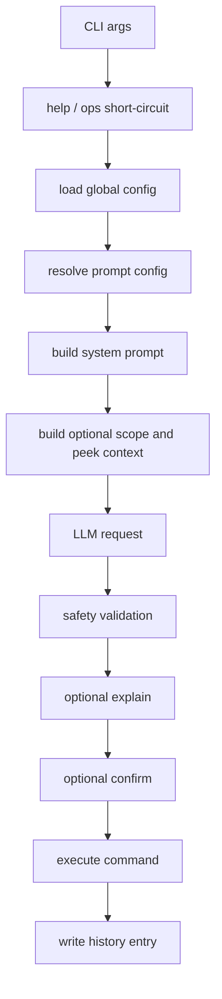

# SAI Technical Design Review

Last reviewed: 2026-04-23

This document covers:

1. The current architecture of the repository.
2. Technical improvements, with explicit guidance for adopting `gpt-5.4-mini`.
3. Possible functional improvements to the product.

## A. Current Architecture

### 1. Product intent

SAI is a Rust CLI that converts natural-language requests into executable shell commands while keeping execution constrained by:

- a whitelisted tool set,
- operator-level safety checks,
- optional confirmation and explanation modes,
- minimal local state in config and history files.

The design is intentionally small. There is one main orchestration path and a small number of focused modules.

### 2. High-level runtime flow



### 3. Module responsibilities

| Module | Responsibility |
| --- | --- |
| `src/main.rs` | Minimal entry point; delegates to `app::run()`. |
| `src/app.rs` | Main orchestration layer for parsing, config loading, LLM calls, explain/confirm, execution, and history logging. |
| `src/cli.rs` | `clap` definition for all flags and positional arguments. |
| `src/config.rs` | YAML-backed config types, environment overrides, and provider resolution into `EffectiveAiConfig`. |
| `src/prompt.rs` | Builds the final system prompt from `meta_prompt` plus tool descriptions. |
| `src/peek.rs` | Reads optional sample files and truncates them to bounded context. |
| `src/scope.rs` | Builds scope hints, including special handling for `-s .`. |
| `src/llm.rs` | Abstracts the model backend behind `CommandGenerator` and `ChatClient`; current implementation uses blocking HTTP. |
| `src/safety.rs` | Splits generated shell text and rejects disallowed operators unless `--unsafe` is used. |
| `src/executor.rs` | Executes safe commands directly and unsafe commands through the shell. |
| `src/history.rs` | Appends invocation metadata to an NDJSON log and rotates it when it grows too large. |
| `src/ops.rs` | Implements `--init`, `--create-prompt`, `--add-prompt`, duplicate resolution, and `--list-tools`. |
| `src/help.rs` | Built-in help system and topic routing. |

### 4. Current data model

The architecture is organized around a few simple contracts:

- `GlobalConfig`
  - contains `ai` settings and optional `default_prompt`.
- `PromptConfig`
  - contains `meta_prompt` and a list of `ToolConfig`.
- `ToolConfig`
  - contains `name`, `config`, and optional `force_explain`.
- `EffectiveAiConfig`
  - resolved runtime provider config for OpenAI or Azure OpenAI.
- `HistoryEntry`
  - log record of the executed run, generated command, and runtime flags.

This is a clean design for a CLI of this size. Most modules are pure or almost pure, which explains why the unit-test surface is already decent.

### 5. Execution path in detail

The current execution path is:

1. Parse CLI arguments and intercept `sai help ...` before normal `clap` execution.
2. Handle operational commands early: `--init`, `--create-prompt`, `--add-prompt`, `--list-tools`.
3. Load the global config.
4. Decide between:
   - simple mode: use `default_prompt`,
   - advanced mode: load a prompt YAML passed as the first positional argument.
5. Build the LLM system prompt from:
   - `meta_prompt`,
   - a flat allowed-tool list,
   - tool-specific instructions.
6. Add optional context:
   - scope hint,
   - `--peek` samples.
7. Call the LLM.
8. Read the first output line as the command.
9. Validate:
   - first token must match an allowed tool,
   - unsafe shell operators are rejected unless `--unsafe` is set.
10. Optionally explain and confirm.
11. Execute the command.
12. Persist a history entry regardless of success or failure.

### 6. Architectural strengths

- The codebase is small and understandable.
- The main seams are explicit:
  - `CommandGenerator`,
  - `ChatClient`,
  - `CommandExecutor`.
- Safety is not only prompt-based; there is post-generation validation.
- The CLI is usable without introducing a database, daemon, or background service.
- History and help are first-class features rather than afterthoughts.
- Most risks are localized to a few files rather than spread across the entire codebase.

### 7. Current technical weaknesses

The code is structurally clean, but several design choices will become bottlenecks:

#### 7.1 Model integration drift

The repo already shows model drift:

- `templates/default-config.yaml` defaults to `gpt-4.1-mini`.
- `README.md` shows `gpt-5.1-mini`.
- `src/llm.rs` is still built around `/v1/chat/completions`.

That means docs, defaults, and transport are not aligned.

#### 7.2 Free-form output contract

The LLM returns unstructured text and SAI takes the first line as the command. This is fragile:

- it depends on prompt obedience,
- explanation leakage can break parsing,
- there is no structured reason code when validation fails,
- there is no model-provided safety metadata.

#### 7.3 Safety checks are string-oriented, not semantic

The current validator blocks obvious operators well, but it still reasons over raw text rather than a command AST or per-tool argument policy. That leaves gaps such as:

- no distinction between read-only and mutating tools,
- no per-flag validation,
- no path policy like “only under cwd”,
- no risk scoring beyond operator presence.

#### 7.4 Prompt/context injection risk

`--peek` and scope hints are inserted as user messages. This is practical, but it means hostile file content can try to steer the model. Current safety helps, but the system does not explicitly separate:

- trusted instructions,
- untrusted file content,
- extracted metadata.

#### 7.5 Blocking network architecture

`reqwest::blocking` is acceptable for a small CLI, but it limits:

- streaming,
- cancellation,
- retries with timeouts,
- future multi-step workflows,
- responsive UX for explanation/analyze modes.

#### 7.6 Limited observability

The history log captures useful metadata, but not:

- model ID after alias resolution,
- request latency,
- token usage,
- validation failure reasons in a structured form,
- which safety rule triggered.

#### 7.7 No versioned config contract

The YAML format is simple, but there is no `version` field or migration path. That makes future changes to:

- provider settings,
- model parameters,
- policy modes,
- prompt packs,

harder to roll out safely.

## B. Technical Improvements

### 1. Align the model/API stack around GPT-5.4 mini

As of 2026-04-23, OpenAI’s official model guidance says:

- use `gpt-5.4` if you want the strongest reasoning and coding model,
- use `gpt-5.4-mini` or `gpt-5.4-nano` when optimizing for latency and cost.

For SAI specifically, `gpt-5.4-mini` is the best default target because the product needs:

- strong coding/tool-use behavior,
- fast single-turn generation,
- high-volume affordability,
- structured outputs support,
- future compatibility with tool-enabled workflows.

Relevant OpenAI facts verified on 2026-04-23:

- `gpt-5.4-mini` is described by OpenAI as “our strongest mini model yet for coding, computer use, and subagents”.
- It supports both `v1/chat/completions` and `v1/responses`.
- It supports structured outputs.
- It has a 400,000-token context window and 128,000 max output tokens.
- The current alias and snapshot shown in docs are `gpt-5.4-mini` and `gpt-5.4-mini-2026-03-17`.

Recommended changes:

1. Short term
   - Change the shipped default model in `templates/default-config.yaml` to `gpt-5.4-mini`.
   - Update `README.md` and all examples so the repo has one default story.
2. Medium term
   - Add config support for:
     - `openai_api_mode: responses | chat_completions`
     - optional `openai_model_snapshot`
     - optional `reasoning_effort`
3. Long term
   - Move the OpenAI path to the Responses API and keep Chat Completions only as a compatibility mode.

### 2. Migrate from free-form text to structured outputs

OpenAI’s current text-generation guidance recommends the Responses API over the older Chat Completions API for new text-generation work. SAI should use that recommendation to tighten its contract.

Recommended response schema:

```json
{
  "command": "rg -n \"CommandGenerator\" src",
  "tool": "rg",
  "intent_summary": "Find the trait definition in source files",
  "risk_level": "low",
  "needs_confirmation": false,
  "notes": []
}
```

Why this matters:

- parsing becomes deterministic,
- explanations can be generated from structured fields,
- safety can inspect `tool` separately from `command`,
- test fixtures become stable,
- repair loops become easier.

If full structured output migration feels too large, introduce it in two phases:

1. Add a “JSON-only output” mode while staying on Chat Completions.
2. Then switch transport to Responses API with schema validation.

### 3. Introduce a real safety policy layer

Current safety should evolve from “operator blacklist” to “policy engine”.

Recommended policy dimensions:

- tool category
  - read-only,
  - mutating,
  - destructive,
  - networked.
- path scope
  - current directory only,
  - allowlisted roots,
  - absolute paths denied unless explicit.
- argument policy
  - allowed flags,
  - forbidden flags,
  - required path normalization.
- runtime mode
  - `safe`,
  - `confirm`,
  - `unsafe`,
  - `readonly`.

This can still remain lightweight. A simple next step is a `ToolPolicy` struct per tool with fields like:

- `category`,
- `allowed_flags`,
- `forbidden_flags`,
- `requires_confirm`,
- `allowed_path_roots`.

### 4. Separate trusted instructions from untrusted context

The current prompt composition is simple, but not ideal for adversarial inputs. Improve it by making the context model explicit:

- system/instructions:
  - stable product rules and safety policy.
- user intent:
  - the human request only.
- evidence:
  - scope listing,
  - peeked content,
  - extracted file metadata.

For `--peek`, avoid sending raw full snippets when a lighter summary would do. Prefer:

- MIME-aware parsing,
- field-name extraction for JSON,
- top-level schema inference,
- filename and extension metadata,
- size-limited previews with redaction hooks.

### 5. Modernize the LLM client layer

`src/llm.rs` should become a provider adapter rather than a single hard-coded request shape.

Recommended design:

- `ModelBackend` trait
  - `generate_command(...)`
  - `explain_command(...)`
  - `analyze_run(...)`
- provider modules
  - `openai_responses`,
  - `openai_chat_completions`,
  - `azure_chat_completions`,
  - future `azure_responses` if needed.

Capabilities should be explicit:

- supports structured outputs,
- supports streaming,
- supports tool calls,
- supports reasoning controls,
- supports snapshots.

That avoids encoding provider assumptions directly into orchestration code.

### 6. Improve runtime resilience

Add:

- request timeout configuration,
- retry policy for transient HTTP failures,
- user-friendly classification of:
  - auth errors,
  - rate limits,
  - provider misconfiguration,
  - schema mismatch,
  - model refusal,
  - validation rejection.

The current error path is good for developers, but end users need clearer operational guidance.

### 7. Add structured observability

Extend `HistoryEntry` or add a second diagnostics log with:

- provider,
- resolved model,
- snapshot if used,
- API mode,
- latency,
- token usage,
- validation result,
- confirm result,
- execution duration.

This will materially improve `--analyze`, which is currently useful but limited by sparse telemetry.

### 8. Version the config format

Add a top-level `config_version` field and migrate configs deliberately. This gives room for:

- profile-based model routing,
- policy presets,
- structured tool definitions,
- future shell-specific behavior.

### 9. Recommended model routing for this project

The cleanest near-term policy is:

| Use case | Recommended model |
| --- | --- |
| Default command generation | `gpt-5.4-mini` |
| `--explain` | `gpt-5.4-mini` |
| `--analyze` | `gpt-5.4-mini` |
| Optional high-accuracy fallback for difficult prompts | `gpt-5.4` |
| Future cheap classification tasks | `gpt-5.4-nano` |

Why this is reasonable:

- command generation is usually short, bounded, and tool-centric,
- explain/analyze are also mostly structured reasoning tasks,
- using one strong mini default keeps behavior consistent,
- escalate to `gpt-5.4` only when there is evidence that the task is ambiguous or repeatedly failing.

### 10. Practical GPT-5.4 mini adoption plan

#### Phase 1: low-risk

- Update defaults and docs to `gpt-5.4-mini`.
- Keep the current request path.
- Add model metadata to history.

#### Phase 2: contract hardening

- Make the model return JSON.
- Validate JSON before shell validation.
- Add richer safety metadata.

#### Phase 3: transport modernization

- Add Responses API support.
- Prefer Responses API for OpenAI.
- Keep Chat Completions only for compatibility or Azure gaps.

#### Phase 4: capability expansion

- add optional tool-enabled reasoning workflows,
- add model-based self-repair when validation fails,
- add multi-candidate ranking.

## C. Possible Functional Improvements

These are product-facing improvements rather than infrastructure work.

### 1. Dry-run and machine-readable output

Add:

- `--dry-run`
  - generate and validate without executing.
- `--json`
  - print structured result instead of human-oriented text.

This is the most useful functional addition for scripting, CI, and debugging.

### 2. Command alternatives

For some prompts, there is more than one safe answer. Add an option like:

- `--alternatives 3`

to return ranked candidate commands with short tradeoff notes. This is valuable for advanced users who want to choose between:

- `rg` vs `grep`,
- `find` vs `rg --files`,
- strict vs broad matching.

### 3. Automatic repair loop

When model output fails validation, do not stop immediately. Retry once or twice with structured feedback such as:

- command used disallowed tool,
- command included pipe,
- output was empty,
- path was invented.

That will improve success rate without reducing safety.

### 4. Read-only and destructive modes

Introduce clearer user-facing safety presets:

- `--mode readonly`
- `--mode standard`
- `--mode destructive`

This is more understandable than making users infer everything from `--unsafe`.

### 5. Better shell-awareness

Today the product is shell-oriented but mostly shell-agnostic. Add explicit targeting:

- `--shell bash`
- `--shell zsh`
- `--shell fish`
- `--shell powershell`

This will matter once the product supports more advanced constructs or Windows-first usage.

### 6. Interactive review UX

The current confirm step is correct but minimal. Improve it with:

- syntax-highlighted command display,
- risk labels,
- highlighted paths,
- explanation summary,
- “show why this was chosen” option.

### 7. Tool discovery and onboarding

The existing `--create-prompt`, `--add-prompt`, and `--list-tools` are a good base. Build on them with:

- auto-detect tools from `PATH`,
- suggested prompt templates,
- domain bundles:
  - source-code search,
  - JSON/log analysis,
  - Git inspection,
  - CSV analysis.

### 8. History search and replay

History becomes more useful if users can:

- search previous prompts,
- re-run past commands,
- compare prompt to generated command,
- inspect repeated failures.

That suggests commands like:

- `sai history search "json"`
- `sai history replay <id>`

### 9. Safer scope assistance

Add an optional pre-step that helps the user choose relevant files before generation:

- auto-suggest likely files from cwd,
- preview matched files for `--scope`,
- warn when `--peek` targets very large or sensitive files.

### 10. Domain-aware prompt packs

The current prompt YAML model is flexible but manual. Provide maintained packs for common jobs:

- codebase inspection,
- logs and observability,
- CSV/TSV,
- JSON APIs,
- filesystem cleanup,
- documentation analysis.

That will improve first-run success and reduce prompt authoring burden.

## Recommended Next Steps

If the goal is practical improvement with minimal churn, the best sequence is:

1. Standardize the repo on `gpt-5.4-mini`.
2. Add structured JSON output for generated commands.
3. Strengthen safety with per-tool policy metadata.
4. Migrate OpenAI from Chat Completions to Responses API.
5. Add `--dry-run`, `--json`, and validation-repair retries.

This preserves the current product shape while fixing the most important architectural weaknesses.

## External References

- OpenAI model selection guide: https://developers.openai.com/api/docs/models
- GPT-5.4 mini model page: https://developers.openai.com/api/docs/models/gpt-5.4-mini
- OpenAI text generation guide: https://platform.openai.com/docs/guides/text?api-mode=responses
