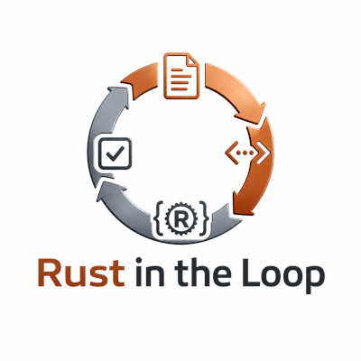

# Rust in the Loop — mdBook project



This directory is an [mdBook](https://rust-lang.github.io/mdBook/) project, built the same way as [The Rust Programming Language](https://github.com/rust-lang/book) and [Rust by Example](https://github.com/rust-lang/rust-by-example). The book's actual content — the fourteen chapters and supporting material — lives under [`src/`](src/README.md).

## Read it

- On disk: start at [`src/README.md`](src/README.md) and follow the links; every file renders as plain Markdown.
- Built and served locally:

  ```bash
  cargo install mdbook   # if not already installed
  mdbook serve tutorial --open
  ```

  This watches for changes and serves the book at `http://localhost:3000`.

- Built once, without serving:

  ```bash
  mdbook build tutorial
  ```

  Output goes to `tutorial/book/` (git-ignored, not committed).

## Structure

```text
tutorial/
  book.toml        mdBook configuration
  src/
    SUMMARY.md      table of contents mdBook reads
    README.md       book front page
    assistant-setup.md  concrete setup for Claude Code, GitHub Copilot, Codex
    chapters/       the 14 chapters
    checkpoints.md, prompts/, exercises/, troubleshooting.md,
    divergences.md, instructor-guide.md, proposal.md
    LICENSE.md      CC BY 4.0 — covers this tutorial's text, not the SAI source code
                    (lives inside src/ so mdBook copies it into the built book)
  scripts/
    check-course.sh  structural QA gate (headings, required files, mdbook build)
```

Run the QA gate after editing any chapter:

```bash
tutorial/scripts/check-course.sh
```

It checks that every chapter has its required section headings, that every supporting file exists and is non-empty, and — if `mdbook` is installed — that the book actually builds.

## License

This tutorial's text is licensed under [CC BY 4.0](src/LICENSE.md), separately from the MIT-licensed SAI source code under `src/` at the repository root (note: that's the *repository's* `src/`, not this tutorial's own `tutorial/src/`). See the [book's front page](src/README.md#license) for the reader-facing version of this notice.
